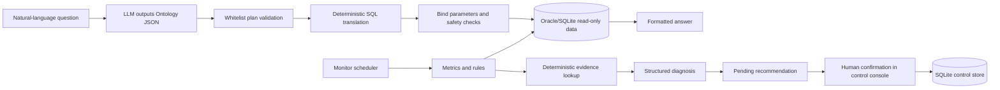

# Ontology Agent

An ontology-driven agent system for retail operations analytics. Inspired by Palantir Ontology's business-object, relationship, and action model, the project maps business questions to controlled Ontology plans and generates parameterized SQL through deterministic code.

The project contains two connected flows:

```text
Natural-language query: question → semantic plan → plan validation → parameterized SQL → read-only query → answer

Anomaly decision flow: monitoring rule → metric snapshot → evidence lookup → diagnosis hypothesis → pending recommendation → task/audit
```

## Design Principles

- The LLM handles semantic understanding, planning, and response wording; it does not directly write or execute SQL.
- SQL can only access objects, properties, and relationships declared in the Ontology configuration.
- Metric definitions, return handling, default filters, and derived formulas are fixed in configuration or deterministic code.
- Business data access is read-only; operational actions require human confirmation.
- Scheduled diagnosis uses an offline template by default, so business facts are not sent to an external model without explicit integration.

## Architecture



## Ontology Objects

The example configuration includes these business objects:

| Object | Description |
|---|---|
| `Order` | Sales order |
| `OrderItem` | Sales order line |
| `Product` | Product/SKU |
| `Store` | Store or retail location |
| `Inventory` | Inventory snapshot |
| `Member` | Member fields approved for analytics |

Users do not need to mention an Object name explicitly. The agent maps business language to objects, properties, relationships, filters, and aggregations. Questions involving domains outside the configuration—such as weather, logistics, or staffing—are rejected or reported as unsupported by the current Ontology.

## Repository Structure

```text
ontology-agent/
├── query_engine.py       # Ontology plan validation, deterministic SQL, read-only execution
├── run_agent.py          # Natural-language query entry point
├── metric_service.py     # Metrics, windows, baselines, and dimension breakdowns
├── monitor_service.py    # Anomaly rules, deduplication, SQLite control store
├── evidence_service.py   # Whitelisted deterministic evidence lookup
├── diagnosis_agent.py    # Structured diagnosis and evidence-ID validation
├── decision_service.py   # Human-confirmation recommendation templates
├── agent_pipeline.py     # Monitor → diagnose → recommend → confirm orchestration
├── monitor_scheduler.py  # One-shot or interval monitoring runner
├── quality_service.py    # Ontology, metric, and rule quality checks
├── web_app.py            # Zero-dependency control console and HTTP API
├── config/
│   └── ontology_models.example.yaml
├── tests/                # Offline unit and integration tests
├── tools/                # Database inspection utilities
└── local/                # Local credentials and real configuration; never commit
```

## Quick Start

### 1. Install dependencies

```powershell
py -m venv .venv
.\.venv\Scripts\Activate.ps1
pip install -r requirements.txt
```

### 2. Prepare local configuration

```powershell
Copy-Item config/ontology_models.example.yaml config/ontology_models.yaml
```

Replace the example table names, column mappings, and business definitions in `config/ontology_models.yaml` for your own data source. Keep real configuration, Oracle credentials, and model keys under `local/`; never commit them to GitHub.

Example Oracle connection file:

```json
{
  "user": "readonly_user",
  "password": "replace-me",
  "dsn": "host:1521/service"
}
```

### 3. Run offline tests

No Oracle connection or model key is required:

```powershell
py -m unittest discover -s tests -v
```

Run the Stage 0 configuration quality check:

```powershell
py quality_service.py --config config/ontology_models.example.yaml
```

### 4. Run a natural-language query

This requires a real local configuration, a read-only Oracle connection, and `DEEPSEEK_API_KEY` (as an environment variable or in `local/deepseek_key.local`):

```powershell
py run_agent.py --question "Which five stores had the highest sales in March 2026?"
```

### 5. Run monitoring and open the console

Enable and calibrate a local monitoring rule before running it:

```powershell
py monitor_scheduler.py `
  --rule inventory_quantity_below_7m `
  --current-window '{"start":"2026-03-01","end":"2026-03-31"}'
```

Start the control console:

```powershell
py web_app.py --port 8787
```

Open <http://127.0.0.1:8787/> in a browser.

Available control APIs:

- `GET /health`
- `GET /anomalies`
- `GET /recommendations`
- `GET /tasks`
- `POST /recommendations/{id}/confirm`
- `POST /anomalies/{id}/feedback`

The control store defaults to `local/monitor_control.sqlite3`. It stores rules, anomalies, recommendations, tasks, feedback, and audit events; it does not write to business tables in Oracle.

## Security Boundaries

The code applies multiple rejection and safety layers:

1. The input gate blocks destructive requests and sensitive-field requests.
2. Plan validation restricts Objects, Properties, Links, operators, aggregate functions, and query limits.
3. SQL must be `SELECT`-only and uses bind parameters.
4. Oracle execution attempts to use a read-only transaction.
5. Member phone numbers, identity numbers, and other PII are not exposed in the public Ontology model.
6. Recommendations create tasks only after human acceptance; inventory and order changes are never executed automatically.

## Current Scope and Next Steps

The current release covers:

- Controlled natural-language data access
- Metric definitions and baseline comparison
- Fixed-threshold and relative-change anomaly monitoring
- Store/SKU dimension scans
- Deterministic evidence lookup
- Structured diagnosis and pending recommendations
- Console confirmation, tasks, feedback, and audit events

Possible next extensions:

- Weather, logistics, and staffing Ontology objects
- A stricter semantic-coverage gate for unsupported questions
- Task state transitions and user authorization
- De-identified snapshots for offline demonstrations
- MCP/API service packaging and production scheduling

## License

MIT
