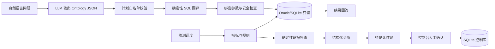

# Ontology Agent

一个面向零售经营分析的语义层与 Agent 系统。项目受 Palantir Ontology 的“业务对象 + 关系 + 动作”理念启发，将业务问题映射为受控的 Ontology 计划，再由确定性代码生成参数化 SQL。

项目包含两条链路：

```text
自然语言查询：问题 → 语义计划 → 计划校验 → 参数化 SQL → 只读查询 → 结果

异常诊断闭环：监测规则 → 指标快照 → 证据补查 → 原因假设 → 待确认建议 → 任务/审计
```

## 设计原则

- LLM 只负责语义理解、规划和表达，不直接生成或执行 SQL。
- SQL 只能访问配置中声明的对象、属性和关联关系。
- 指标口径、退货处理、默认过滤和派生公式由配置/代码固定。
- 数据源只读；经营动作默认不自动执行，必须经过人工确认。
- 诊断调度默认使用离线模板，避免业务事实未经确认发送到外部模型。

## 架构



## Ontology 对象

示例配置包含以下业务对象：

| Object | 说明 |
|---|---|
| `Order` | 销售单 |
| `OrderItem` | 销售明细 |
| `Product` | 商品 |
| `Store` | 门店 |
| `Inventory` | 库存 |
| `Member` | 会员安全字段 |

用户不需要在问题中显式说出 Object。Agent 会将业务语言映射到对象、属性、关联、过滤条件和聚合。如果问题涉及配置外的领域，例如天气、物流或排班，当前系统会拒绝或提示 Ontology 未覆盖。

## 目录结构

```text
ontology-agent/
├── query_engine.py       # Ontology 计划校验、确定性 SQL 翻译、只读执行
├── run_agent.py          # 自然语言查询入口
├── metric_service.py     # 指标、时间窗口、基线、维度拆解
├── monitor_service.py    # 异常规则、去重、SQLite 控制面
├── evidence_service.py   # 白名单证据补查
├── diagnosis_agent.py    # 结构化原因假设与证据 ID 校验
├── decision_service.py   # 待人工确认的建议模板
├── agent_pipeline.py     # 监测 → 诊断 → 建议 → 确认编排
├── monitor_scheduler.py  # 单次/周期监测入口
├── web_app.py            # 零依赖控制台与 HTTP API
├── config/
│   └── ontology_models.example.yaml
├── tests/                # 离线单元与集成测试
├── tools/                # 数据盘点工具
└── local/                # 本地凭证与真实配置，不提交 Git
```

## 快速开始

### 1. 安装依赖

```powershell
py -m venv .venv
.\.venv\Scripts\Activate.ps1
pip install -r requirements.txt
```

### 2. 准备本地配置

```powershell
Copy-Item config/ontology_models.example.yaml config/ontology_models.yaml
```

然后将 `config/ontology_models.yaml` 中的示例表名、字段名和口径映射替换为自己的数据源配置。真实配置、Oracle 凭证和模型 Key 只放在 `local/`，不要提交到 GitHub。

Oracle 连接文件示例结构：

```json
{
  "user": "readonly_user",
  "password": "replace-me",
  "dsn": "host:1521/service"
}
```

### 3. 离线测试

不需要 Oracle 或模型 Key：

```powershell
py -m unittest discover -s tests -v
```

### 4. 自然语言查询

需要本地真实配置、只读 Oracle 连接和 `DEEPSEEK_API_KEY`（环境变量或 `local/deepseek_key.local`）：

```powershell
py run_agent.py --question "2026年3月销售额最高的5家门店？"
```

### 5. 监测与控制台

启用并校准本地监测规则后运行一次：

```powershell
py monitor_scheduler.py `
  --rule inventory_quantity_below_7m `
  --current-window '{"start":"2026-03-01","end":"2026-03-31"}'
```

启动控制台：

```powershell
py web_app.py --port 8787
```

浏览器打开：<http://127.0.0.1:8787/>

控制 API：

- `GET /health`
- `GET /anomalies`
- `GET /recommendations`
- `GET /tasks`
- `POST /recommendations/{id}/confirm`
- `POST /anomalies/{id}/feedback`

控制库默认是 `local/monitor_control.sqlite3`，只保存规则、异常、建议、任务、反馈和审计，不写回业务 Oracle。

## 安全边界

当前代码包含多层拒绝：

1. 入口拦截删除、修改、敏感字段等危险请求。
2. 计划校验限制 Object、Property、Link、算子、聚合函数和查询上限。
3. SQL 只允许 `SELECT`，并使用绑定参数。
4. Oracle 查询尝试设置只读事务。
5. 会员手机号、身份证等字段不进入公开 Ontology。
6. 建议只有人工采纳后才创建任务，不自动执行库存或订单变更。

## 当前范围与后续方向

当前版本已覆盖：

- 受控自然语言取数
- 指标定义与基线对比
- 固定阈值/相对变化异常监测
- 门店/SKU 维度扫描
- 确定性证据补查
- 结构化诊断和待确认建议
- 页面确认、任务、反馈和审计

后续可继续建设：

- 天气、物流、排班等新的 Ontology 对象
- 更严格的“问题语义覆盖检查”
- 任务状态流转和权限认证
- 脱敏快照与离线演示数据
- MCP/API 服务化与生产调度

## License

MIT
